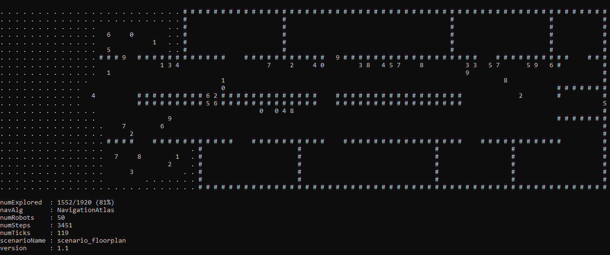

# Atlas: Exploration and Mapping with a Sparse Swarm of Networked IoT Robots

## Releases

Each major release contains the source code, the log file captured after a long simulation run, and the resulting plots.

## Reproduing a Simulation

- Install [Python 3.x](https://www.python.org/downloads/)
- Install Python dependencies: `pip install -r requirements.txt`
- start a simulation: `python Atlas.py`
- Depending on the settings of the simulation, this can take several hours. The simulation ends with "Done."
- When finished, `AtlasLog_<timestamp>.json` contains the following log file for all runs
- Open `DrawResults.ipynb` using [Jupyter Notebook](https://jupyter.org/) to re-create the plots.

## Turning on the Map View

In the `Atlas.py`, set `UI` to `True` to turn on the map view.
This significantly slows down the simulation.