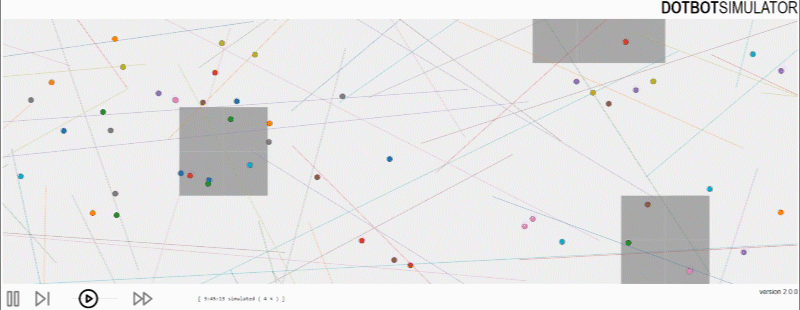

# Atlas: Exploration and Mapping with a Sparse Swarm of Networked IoT Robots



## Releases

Each major release contains the source code, the log file captured after a long simulation run, and the resulting plots.

## Reproducing a Simulation

- Install [Python 3.x](https://www.python.org/downloads/)
- Install Python dependencies: `pip install -r requirements.txt`
- start a simulation: `python RunSim.py`
- once mapping finished, boundary line turns green

## Contributors

[Razanne Abu-Aisheh](https://www.linkedin.com/in/razanne-abu-aisheh-602b06105/),
[Thomas Watteyne](http://www.thomaswatteyne.com),
[Francesco Bronzino](https://www.bell-labs.com/usr/francesco.bronzino),
[Myriana Rifai](https://www.linkedin.com/in/myriana-rifai-5b6b40b1/),
[Felipe Campos](https://www.linkedin.com/in/felipe-rocha-campos/),
[Brian Kilberg](https://www.linkedin.com/in/brian-kilberg/),
[Kris Pister](https://bamlab.berkeley.edu/).

## Packet Formats

### from orchestrator

```
frame = {
    'frameType': FRAMETYPE_COMMAND,
    'movements': {
        1: {
            'heading': 120.89, 
            'speed':   1,
        },
        2: {
            'heading': 120.89, 
            'speed':   1,
        }
        3: {
            'heading': 120.89, 
            'speed':   1,
        }
    }
}
```

### from node

```
frame = {
    'frameType': FRAMETYPE_NOTIFICATION,
    'source':    1,
    'movementDuration': self.tsMovementStop - self.tsMovementStart, # amount of time robot moved until it stopped 
}
```

## JSON API formats

### dotbots.json

```
{
    "mode":          "play",
    "simulatedTime": "[  0:00:07 simulated (    1 &times; ) ]",
    "dotbots": [
        {
            "x":                  1.0,
            "y":                  0.414,
            "next_bump_x":        1.0,
            "next_bump_y":        5.0,
            "orchestratorview_x": 1.0,
            "orchestratorview_y": -0.0
        },
        ...
    ],
    "discomap": {
        "complete":              false,
        "dots": [
            [1.0, -0.0],
            ...
        ],
        "lines": []
    },
    "exploredCells": {
        "cellsOpen": [
            {"x": 0.75, "y": 0.75, "width": 0.5, "height": 0.5},
            ...
        ],
        "cellsObstacle": [
            {"x": 0.75, "y": -0.25, "width": 0.5, "height": 0.5},
            ...
        ]
    }
}
```
